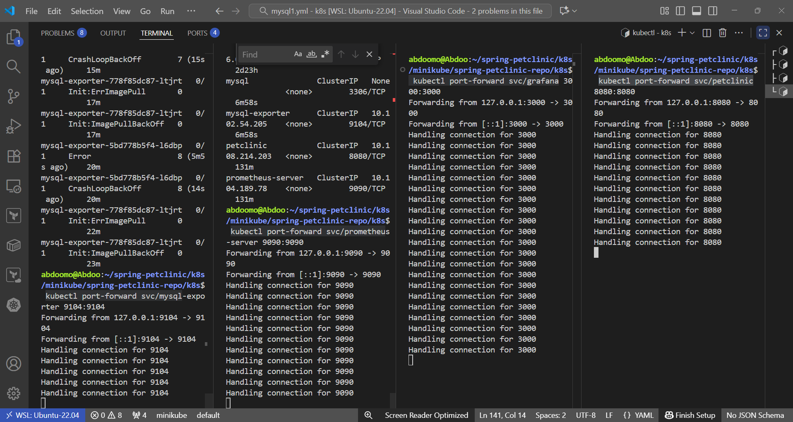

# 🐾 Spring PetClinic on Kubernetes (Minikube)

This repository contains Kubernetes manifests and scripts to deploy the Spring PetClinic application on a local Minikube cluster. It includes monitoring tools like Prometheus and Grafana, and a MySQL database with metrics exporter.

---

## 📁 Folder Structure

| File              | Description |
|------------------|-------------|
| `deploy.sh`       | Shell script to deploy all resources in order. |
| `petclinic.yml`   | Deployment and service for the Spring PetClinic application. |
| `mysql1.yml`      | MySQL StatefulSet, secrets, PVC, exporter, and services. |
| `prometheus.yml`  | Prometheus deployment and service. |
| `grafana.yml`     | Grafana deployment and service. |
| `svc.yml`         | Additional service definitions (e.g., for PetClinic). |
| `ingress.yml`     | Ingress rules for PetClinic, Prometheus, and Grafana. |

---

## 📸 Screenshots & Analysis

### 🏥 Spring PetClinic Homepage

- The application is successfully deployed and reachable via port 8080.

### 📦 Kubernetes Resources Overview

- All Pods, Deployments, StatefulSets, and Services are running as expected.
- `mysql-exporter` is active and ready.

### 📊 Spring metrics in Grafana

- JVM metrics are collected via Micrometer.
- Heap and non-heap memory usage is low; uptime is stable.

### 🐬 MySQL Metrics Dashboard

- MySQL metrics like uptime, QPS, and connections are collected successfully.
- `mysql-exporter` is functional and feeding Prometheus.

### 📈 Prometheus Targets

- Prometheus is scraping metrics from Spring Boot, MySQL Exporter, and itself.

### 🧑💻 Kubernetes Port-Forwarding

- Local ports mapped for Grafana, PetClinic, Prometheus, and MySQL Exporter.
- Enables browser access via `localhost`.

### 📄 MySQL Exporter Metrics Endpoint

- Shows raw metrics at `/metrics`.
- Confirms the exporter is running and exposing Prometheus-compatible metrics.

---

## 🚀 Deployment Steps

1. Start Minikube:
```bash
minikube start
````

2. Enable Ingress Controller:

```bash
minikube addons enable ingress
```

3. Deploy all resources:

```bash
./deploy.sh
```

Or manually:

```bash
kubectl apply -f mysql1.yml
kubectl apply -f petclinic.yml
kubectl apply -f prometheus.yml
kubectl apply -f grafana.yml
kubectl apply -f svc.yml
kubectl apply -f ingress.yml
```

---

## 🌐 Accessing Services

Update your `/etc/hosts` file with:

```
127.0.0.1 petclinic.local prometheus.local grafana.local
```

Then access:

* 🏥 **PetClinic App** → [http://petclinic.local](http://petclinic.local)
* 📈 **Prometheus** → [http://prometheus.local](http://prometheus.local)
* 📊 **Grafana** → [http://grafana.local](http://grafana.local)

---
